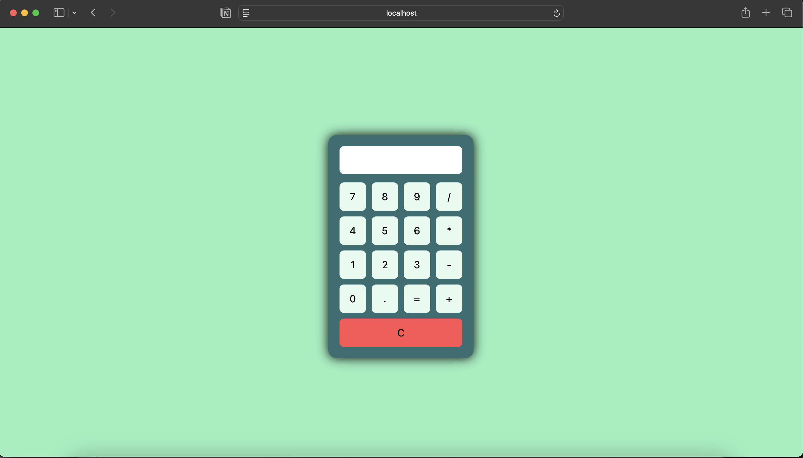

# 🧮 Calculator Web Application

## 📌 Project Overview
This project is a simple calculator web application developed as a practice project to apply basic web development concepts. It allows users to perform basic arithmetic operations through a clean and simple user interface. The project focuses on understanding how front-end forms interact with back-end logic using PHP.

## 🎯 Project Objectives
* Practice building web pages using HTML and CSS.
* Learn how to handle user input through forms.
* Apply basic PHP logic for calculations.
* Understand server-side processing using GET/POST methods.

## 💻 Technologies Used
* HTML – Structure of the web page.
* CSS – Styling and layout.
* PHP – Handling form data and calculation logic.

## ⚙️ Features
* Basic arithmetic operations (addition, subtraction, multiplication, division).
* Simple and user-friendly interface.
* Form-based input handling.
* Server-side processing using PHP.

## 🧠 What I Learned
* How to create and style HTML forms.
* Handling user input using GET/POST in PHP.
* Writing basic conditional logic in PHP.
* Connecting front-end input with back-end processing.

## 🎥 Project Demo
Click below to view the demo video:

## 📬 Contact
If you would like to get in touch, feel free to contact me at:

📧 **Email:** arwaahalzain@email.com
